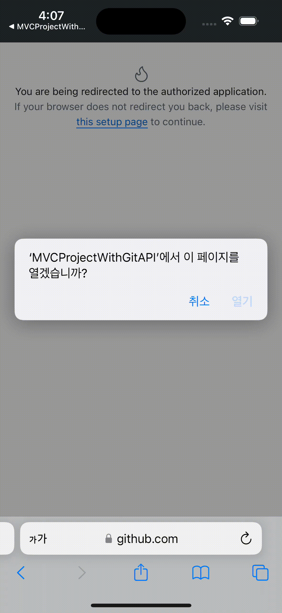
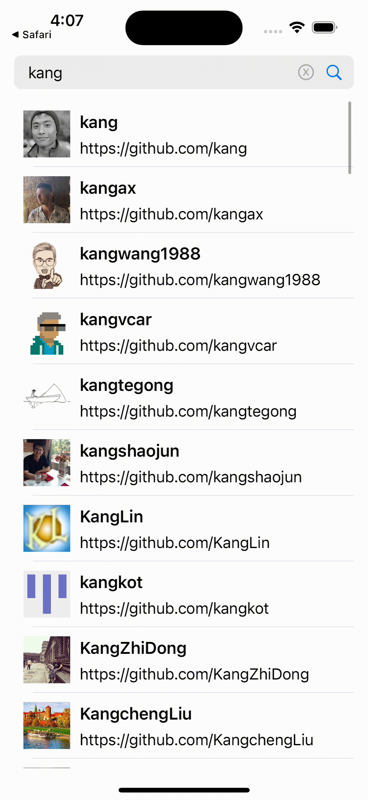

# MVCProjectWithGitAPI

  

### 프로젝트 소개(ProjectWithGitAPI)  
이전에 혼자 진행한 작은 프로젝트를 디자인 패턴을 맞추는 것에 중점을 두고 다시 프로젝트를 구성했습니다.  
당시에는 `MVVM` 아키텍처로 구현했었지만 진행하는 과정에서 스스로 디자인 패턴에 대한 이해도가 부족하다고 느꼈습니다.  
<br>
그래서 디자인 패턴을 다시 학습한 후, `MVC` 패턴부터 시작하여 동일한 기능을 다양한 디자인 패턴으로 구현하는 프로젝트를 진행하고 있습니다.  
해당 프로젝트는 규모가 작지만, `API 사용`, `네트워킹`, `이미지 Caching`, `페이징 처리` 등 학습한 기술들을 적극 활용할 수 있었습니다.  
그래서 **ProjectWithGitAPI** 라는 이름으로 디자인 패턴을 공부하기 위한 프로젝트로 채택하게 되었습니다.

### 학습한 내용(MVC)  
#### 패턴을 적용하며 중점적으로 고려한 부분들
- `View`는 **UI**를 담당
- `Controller`는 `View`와 `Model`의 **중간 역할**과 동시에 **프레젠테이션 로직** 담당
- `Model`은 데이터와 **비즈니스 로직**을 담당
- `View`를 `Controller`에서 최대한 분리(ViewController를 최대한 가볍게 하기)

  

#### 느낀점
UIKit 환경에서 `MVC`는 생각보다 흐름이 매끄럽다고 느꼈습니다.  
화면의 입력과 출력이 합쳐진 `UIViewController`에서 프레젠테이션 로직을 담당하기 때문에  
디자인 패턴을 준수하기 위한 추가 코드가 적었습니다.  
<br>
그리고 항상 거론되는 문제인 **MassiveViewController**가 있는데,  
프로젝트의 볼륨이 작은 점도 작용했지만 `View`를 최대한 분리하면 생각보다 무겁지 않았습니다.  
<br>
진행하면서 헷갈렸던 부분은 모델을 어떻게 세분화 할까였습니다.  
해당 프로젝트는 모델을 크게 **데이터 타입(UserInfo)**, **모델(~Model)**, **서비스(~Service)** 로 나누었습니다.  
데이터 타입은 해당 데이터 타입을 정의하고 모델에서는 비즈니스 로직의 사용과 데이터를 들고 있도록 설계하였습니다.  
마지막으로 서비스는 코어한 비즈니스 로직을 담았습니다.  
[공부한 내용을 정리한 블로그](https://dev-kang.tistory.com/37)  
<br>

### 작업 Flow - TBD(Trunk Based Develop)
  - 단일한 브랜치(Main or Trunk)에 수시로 병합(merge)
  - 브랜치의 수명을 가능한 짧게 가져감
  - [TBD에 대한 내용을 정리한 블로그](https://dev-kang.tistory.com/36)

### 개발 및 테스트 환경 버전
  - Xcode 15.3
  - iOS 16+
  - iPhone15 시뮬레이터
  - Portrait Only
  - LightMode Only 
### 프로젝트 실행 방법
```
프로젝트 빌드 시 Secrets.configs 파일이 필요합니다.
본 프로젝트 실행을 위해 파일이 필요할 시 spdlqjrkdrjs@naver.com으로 요청해주세요.
```
- git clone
```
git clone https://github.com/kangsworkspace/MVCProjectWithGitAPI
```
- 현재 브랜치가 main에 있는지 확인하십시오.
- Simulator 기기를 iPhone15로 설정하고 빌드합니다.
<br>

### 구현 내용(구현 내용은 다른 ProjectWithGitAPI와 동일합니다)
 - <b> 깃 로그인 구현(임시 코드 및 access_token 획득) </b>
 
    
    
 
 - <b> 커스텀 SearchView 구현 </b>
 
  | |  | 
  |--|--|
 
 - <b> API사용, 페이징 처리, 이미지 캐싱처리 구현 </b>
    

 - <b> URL주소로 이동(SafariServices) </b>
  

## Library
- [Then](https://github.com/devxoul/Then)
- [Moya](https://github.com/Moya/Moya)
